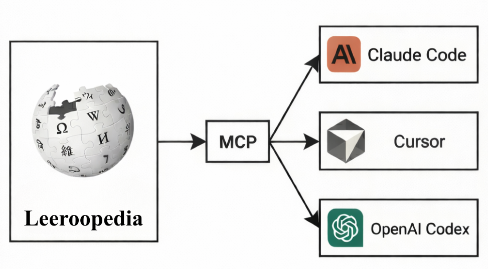
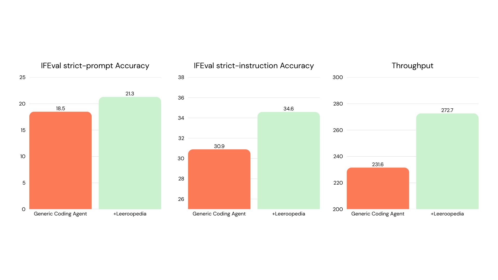
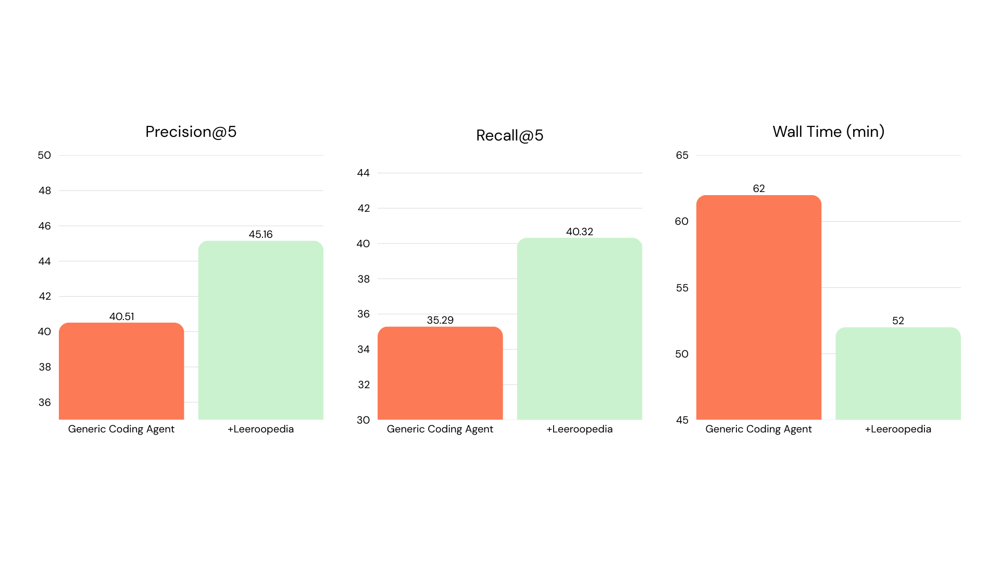
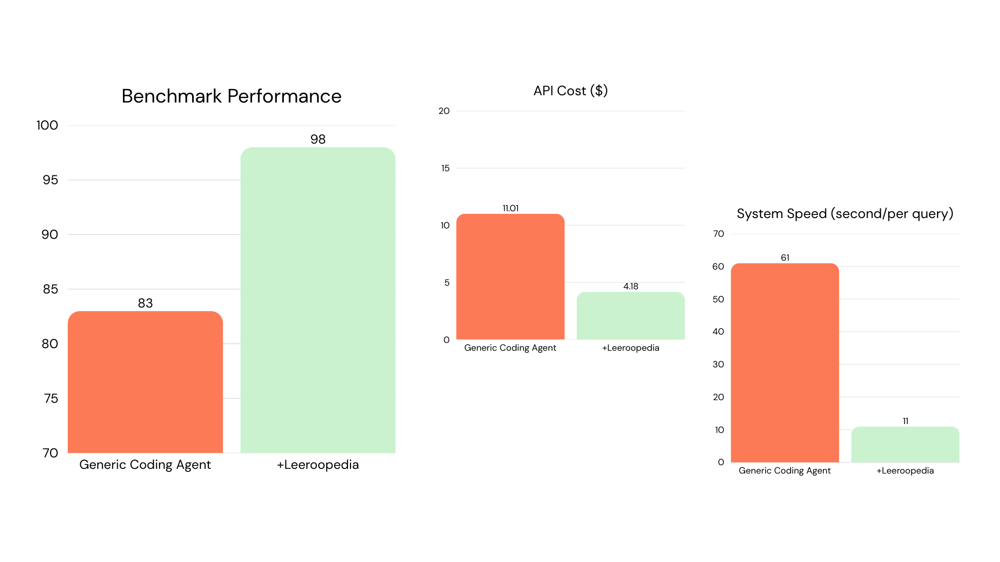

# Leeroopedia MCP Server

<p align="center">
  <strong>Give your AI coding agent access to best-practices of ML and AI.</strong>
</p>

<p align="center">
  <a href="https://leeroopedia.com"></a>
  <a href="https://pypi.org/project/leeroopedia-mcp/"></a>
  <a href="https://docs.leeroopedia.com"></a>
  <a href="https://discord.gg/hqVbPNNEZM"></a>
  <a href="https://github.com/Leeroo-AI/leeroopedia-mcp"></a>
  <a href="https://www.ycombinator.com/companies/leeroo"></a>
</p>

<p align="center">
  
</p>

---

> **$20 free credit on sign-up** : that's plenty of searches, plans, and diagnoses. Skip the guesswork on your next fine-tuning run or inference deployment. No credit card required. [Get your API key →](https://app.leeroopedia.com)

## What is Leeroopedia?

**Your ML & AI Knowledge Wiki.** Learnt by AI, built by AI, for AI.

Expert-level knowledge across the full ML & AI stack, from fine-tuning and distributed training, to inference serving and GPU kernel optimization, to building agents and RAG pipelines. **1000+ frameworks and libraries**, all in one place.

This MCP server turns your AI coding agent (Claude Code, Cursor, OpenAI Codex, ...) into an ML/AI expert engineer.

Browse the full knowledge base at [leeroopedia.com](https://leeroopedia.com).

### Want to go end-to-end?

Leeroopedia gives your agent the **knowledge**. [**Kapso**](https://github.com/leeroo-ai/kapso) gives it the **ability to act on it** : research, experiment, and deploy. Together: a complete ML/AI engineer agent.

## Benchmarks

We measured the effect of Leeroopedia MCP on real ML tasks built by Claude Code.

- **ML Inference Optimization**: Write CUDA/Triton kernels for 10 KernelBench problems. **2.11x** geomean speedup vs 1.80x (**+17%**), with/without Leeroopedia MCP. [→ results](examples/ml_inference_optimization/)

- **LLM Post-Training**: End-to-end SFT + DPO + LoRA merge + vLLM serving + IFEval on 8×A100. **21.3 vs 18.5** IFEval strict-prompt accuracy, **34.6 vs 30.9** strict-instruction accuracy, **272.7 vs 231.6** throughput. [→ results](examples/llm_post_training/)

  

- **Self-Evolving RAG**: Build a RAG service that automatically improves itself over multiple rounds. **45.16 vs 40.51** Precision@5, **40.32 vs 35.29** Recall@5, in **52 vs 62 min** wall time. [→ results](examples/self_evolve_rag/)

  

- **Customer Support Agent**: Multi-agent triage system classifying 200 tickets into 27 intents. **98 vs 83** benchmark performance, **11s vs 61s** per query. [→ results](examples/customer_support_agent/)

  

## Quick Start

### 1. Get Your API Key

1. Go to [app.leeroopedia.com](https://app.leeroopedia.com)
2. Create an account or log in
3. Navigate to **Dashboard > API Keys**
4. Copy your API key (format: `kpsk_...`)

### 2. Use the hosted server (no installation needed)

Just paste this URL into any MCP client that supports remote servers:

```
https://mcp.leeroopedia.com/mcp?token=kpsk_your_key_here
```

See the **[connect guides](https://docs.leeroopedia.com)** for all IDEs, running locally, and troubleshooting.

### 3. Configure Claude Code

**Remote (no install):**

```bash
claude mcp add --transport http leeroopedia "https://mcp.leeroopedia.com/mcp?token=kpsk_your_key_here"
```

**Local (via uvx):**

Add to your `~/.claude.json` or project `.mcp.json`:

```json
{
  "mcpServers": {
    "leeroopedia": {
      "command": "uvx",
      "args": ["leeroopedia-mcp"],
      "env": {
        "LEEROOPEDIA_API_KEY": "kpsk_your_key_here"
      }
    }
  }
}
```

> **Getting `spawn uvx ENOENT`?** Your IDE can't find `uvx` in its PATH. Run `which uvx` (or `where uvx` on Windows) in your terminal to get the full path, then use it in your config:
> ```json
> "command": "/home/username/.local/bin/uvx"
> ```
> Common locations: `~/.local/bin/uvx` (Linux), `~/.local/bin/uvx` (macOS curl install), `/opt/homebrew/bin/uvx` (macOS Homebrew).

### 4. Configure Cursor

**Remote (no install):**

Add to your Cursor settings (`.cursor/mcp.json`):

```json
{
  "mcpServers": {
    "leeroopedia": {
      "url": "https://mcp.leeroopedia.com/mcp?token=kpsk_your_key_here"
    }
  }
}
```

**Local (via uvx):**

```json
{
  "mcpServers": {
    "leeroopedia": {
      "command": "uvx",
      "args": ["leeroopedia-mcp"],
      "env": {
        "LEEROOPEDIA_API_KEY": "kpsk_your_key_here"
      }
    }
  }
}
```

> **Getting `spawn uvx ENOENT`?** See the tip in [Configure Claude Code](#3-configure-claude-code) above.

### 5. Configure OpenAI Codex

Run the CLI command:

```bash
codex mcp add leeroopedia --env LEEROOPEDIA_API_KEY=kpsk_your_key_here -- uvx leeroopedia-mcp
```

Or add to your `~/.codex/config.toml`:

```toml
[mcp_servers.leeroopedia]
command = "uvx"
args = ["leeroopedia-mcp"]

[mcp_servers.leeroopedia.env]
LEEROOPEDIA_API_KEY = "kpsk_your_key_here"
```

> **Getting `spawn uvx ENOENT`?** See the tip in [Configure Claude Code](#3-configure-claude-code) above.

### 6. Optional: Add the Agent Skill File

For coding agents that support project-level instruction files (Claude Code, Cursor, Codex), you can add an optional skill file that teaches the agent **when and how** to pick the right Leeroopedia tool for each situation. This improves tool selection, encourages parallel searches, and provides canonical workflows for common tasks like "How do I implement X?" or "My run crashed".

Download [`SKILL.md`](https://raw.githubusercontent.com/Leeroo-AI/leeroopedia-mcp/main/SKILL.md) and place it in the appropriate location for your agent:

| Agent | Where to place the file | Format |
|-------|------------------------|--------|
| **Claude Code** | Project root or `CLAUDE.md` (paste the content) | Markdown |
| **Cursor** | `.cursor/rules/leeroopedia.md` (or add as an Agent Skill) | Markdown |
| **Codex** | Project root `AGENTS.md` (paste the content) | Markdown |

> This step is optional. The MCP tools work without the skill file. The skill file just helps the agent make better tool choices automatically.

## Documentation

> **[docs.leeroopedia.com](https://docs.leeroopedia.com)** — full setup guides, environment variables, troubleshooting, connect guides for every IDE, and detailed tool usage.

## Contributing

We welcome contributions! Please see our [Contributing Guide](CONTRIBUTING.md) for details on how to get started.

This project follows our [Code of Conduct](CODE_OF_CONDUCT.md).

## License

This project is licensed under the [MIT License](LICENSE).
