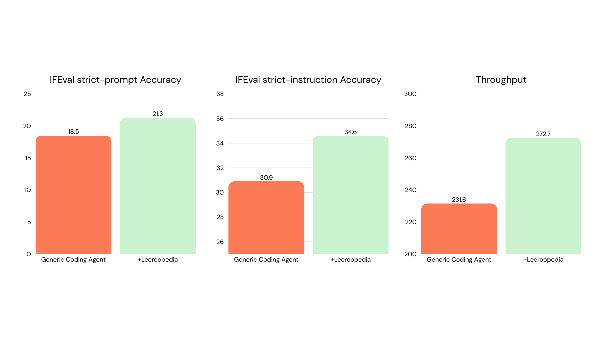
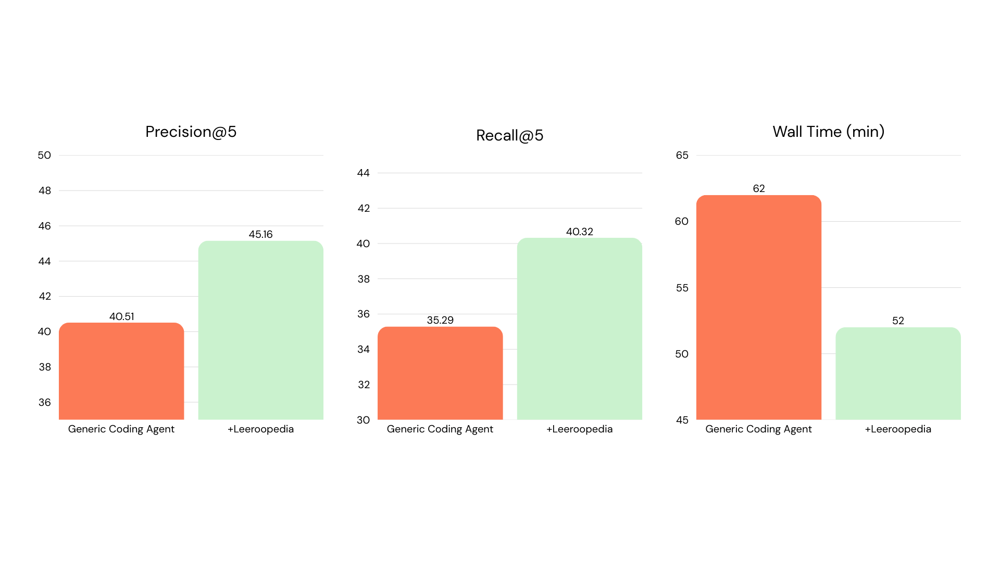
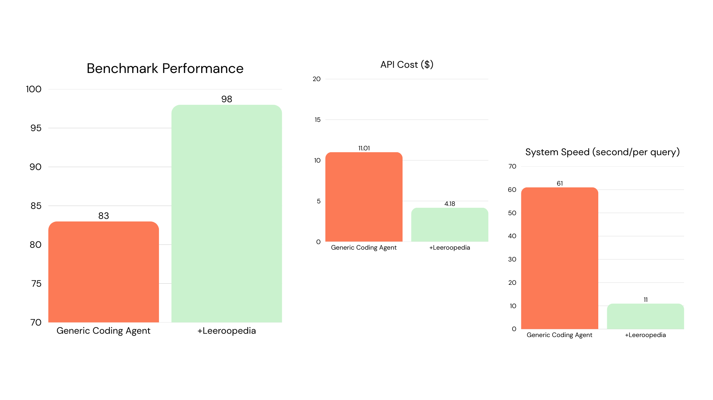

## GPU Kernel Optimization

Write custom CUDA/Triton kernels for 10 [KernelBench](https://github.com/ScalingIntelligence/KernelBench) problems spanning element-wise ops, fused operator chains, and full transformer blocks. Each solution must produce correct outputs and run faster than the PyTorch reference.

| Metric | Baseline | + Leeroopedia |
|--------|:--------:|:-------------:|
| **Geometric mean speedup** | 1.80x | **2.11x (+17%)** |

**What made the difference:** The KB agent discovered **TF32 tensor cores**, a hardware feature that doubles matmul throughput with no precision loss for inference. This gave **+110% speedup** on transformer blocks (3.67x vs 1.75x). The KB agent also fused Swish+Bias+GroupNorm into a single Triton kernel and wrote custom depthwise conv kernels with float4 vectorization + CUDA Graphs, while the baseline fell back to cuDNN.

[→ Full results and replication instructions](https://github.com/Leeroo-AI/leeroopedia-mcp/tree/main/examples/ml_inference_optimization)

---

## LLM Post-Training

Implement a complete SFT + DPO fine-tuning, LoRA merge, vLLM serving, and IFEval evaluation pipeline for `Qwen/Qwen2.5-1.5B` on 8×A100 GPUs.

| Metric | Baseline | + Leeroopedia |
|--------|:--------:|:-------------:|
| **IFEval strict-prompt accuracy** | 18.5 | **21.3** |
| **IFEval strict-instruction accuracy** | 30.9 | **34.6** |
| **Throughput** | 231.6 | **272.7** |

**What made the difference:** The KB agent queried hyperparameter priors and chose a **25x lower DPO learning rate** (2e-6 vs 5e-5), avoiding divergence during preference optimization. It also merged the SFT adapter into base weights before creating a fresh LoRA for DPO (avoiding stacked adapters), used a proper train/eval split for DPO, and shuffled datasets with a fixed seed.

[→ Full results and replication instructions](https://github.com/Leeroo-AI/leeroopedia-mcp/tree/main/examples/llm_post_training)

---

## Self-Evolving RAG

Build a FastAPI service that ingests a corpus, answers questions via hybrid retrieval-augmented generation, and **automatically improves itself** over multiple evolution rounds by diagnosing retrieval failures, re-chunking documents, and adapting query strategies.

| Metric | Baseline | + Leeroopedia |
|--------|:--------:|:-------------:|
| **Precision@5** | 40.51 | **45.16** |
| **Recall@5** | 35.29 | **40.32** |
| **Wall time** | 62 min | **52 min** |

**What made the difference:** The KB agent used **DBSF (3-sigma) score normalization** for fusing BM25 and vector scores instead of Reciprocal Rank Fusion. This preserved score magnitude information, letting the evolution loop meaningfully adjust fusion weights. It also used a **blue-green collection pattern** for ChromaDB index swaps instead of a simpler lock-based pointer swap.

[→ Full results and replication instructions](https://github.com/Leeroo-AI/leeroopedia-mcp/tree/main/examples/self_evolve_rag)

---

## Customer Support Agent

Build a multi-agent system that classifies 200 customer support tickets into 27 fine-grained intent categories using agent handoffs, state persistence, and structured output.

| Metric | Baseline | + Leeroopedia |
|--------|:--------:|:-------------:|
| **Benchmark performance** | 83 | **98** |
| **System speed (sec/query)** | 61 | **11** |

**What made the difference:** A single KB lookup taught the agent **typed handoff callbacks with `input_type`**, a framework-specific pattern in the OpenAI Agents SDK. The baseline used fragile regex extraction from free text, while the KB agent registered each handoff with a Pydantic model that the SDK enforces at handoff time. The KB also taught proper state serialization and `output_type` usage.

[→ Full results and replication instructions](https://github.com/Leeroo-AI/leeroopedia-mcp/tree/main/examples/customer_support_agent)
