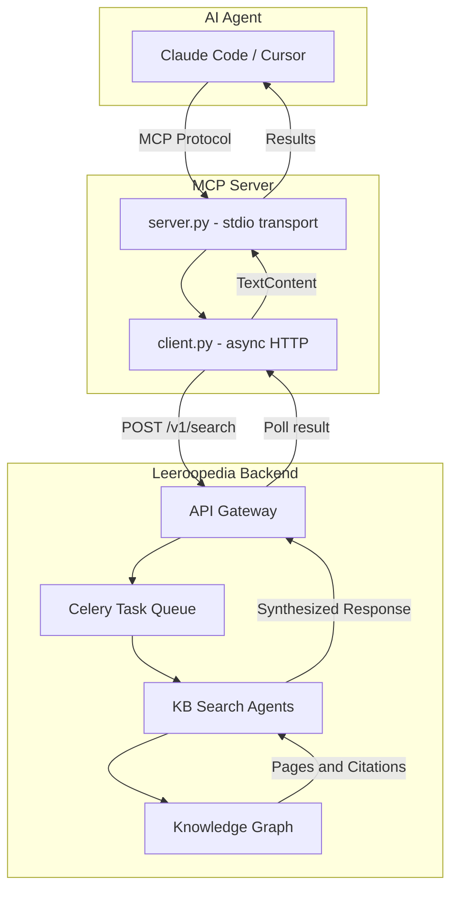

## Architecture

The Leeroopedia MCP server is a **thin client** -- it contains no search logic or knowledge base access itself. All intelligence lives on the backend.

## Request Lifecycle

<Steps>
  <Step title="Agent calls a tool">
    Your AI coding agent calls a tool (e.g., search_knowledge) via the MCP protocol. The server validates the tool name and arguments.
  </Step>

  <Step title="Task created on backend">
    The MCP client sends POST /v1/search with the tool name and arguments. The backend queues the task and returns a task_id immediately.
  </Step>

  <Step title="Polling with exponential backoff">
    The client polls GET /v1/search/task/task_id with exponential backoff. Starts at 0.5 seconds, grows by 1.5x each iteration, caps at 5 seconds between polls, and times out after 300 seconds (configurable).
  </Step>

  <Step title="Results returned">
    When the task completes, the synthesized response is returned to your agent as TextContent, including PageID citations and remaining credits.
  </Step>
</Steps>

## Why Async Tasks?

The backend runs AI agents that search the knowledge base from multiple angles, read relevant pages, and synthesize structured responses. This can take 10-60 seconds depending on the tool and query complexity.

The async task pattern (create task, then poll) avoids HTTP timeouts and lets the backend agents take the time they need for thorough research.

## Components

| Component | File | Role |
|-----------|------|------|
| **MCP Server** | server.py | Handles MCP protocol over stdio, validates tools, returns results |
| **HTTP Client** | client.py | Async task creation and polling with exponential backoff |
| **Config** | config.py | Reads configuration from environment variables |
| **Tool Definitions** | tools.py | Defines the 8 tools with names, descriptions, and JSON schemas |

## Transport

The server uses **stdio transport** (stdin/stdout), which is the standard for Claude Code and Cursor MCP integrations. Logging goes to **stderr** to avoid interfering with the MCP protocol on stdout.
