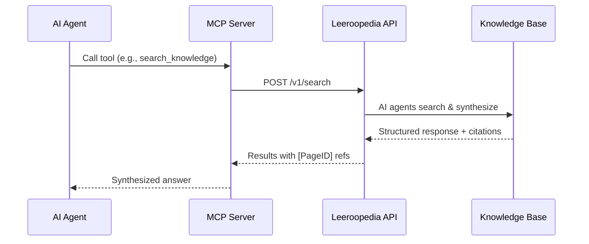

## What is Leeroopedia?

**Your ML & Data Knowledge Wiki.** Learnt by AI, built by AI, for AI. A centralized playbook of best practices and expert-level knowledge for Machine Learning and Data domains.

This MCP server lets AI coding agents (Claude Code, Cursor) search that knowledge base directly while they work — no copy-pasting needed.

Browse the full knowledge base at [leeroopedia.com](https://leeroopedia.com).

## How It Works

Your AI agent calls a tool (e.g., `search_knowledge`). The MCP server forwards the request to the Leeroopedia backend, where AI agents search the knowledge base from multiple angles, read relevant pages, and synthesize a structured response with citations.

## Available Tools

The server provides **8 agentic tools**. Each tool (except `get_page`) triggers an AI agent on the backend that searches, reads, and synthesizes responses from the knowledge base.

<CardGroup cols={2}>
  <Card title="search_knowledge" icon="magnifying-glass" href="/docs/tools/search-knowledge">
    Search the KB for framework docs, APIs, and best practices
  </Card>
  <Card title="build_plan" icon="list-check" href="/docs/tools/build-plan">
    Build a step-by-step ML execution plan
  </Card>
  <Card title="review_plan" icon="clipboard-check" href="/docs/tools/review-plan">
    Review a plan against KB best practices
  </Card>
  <Card title="verify_code_math" icon="code" href="/docs/tools/verify-code-math">
    Verify code against authoritative ML/math descriptions
  </Card>
  <Card title="diagnose_failure" icon="stethoscope" href="/docs/tools/diagnose-failure">
    Diagnose training/deployment failures
  </Card>
  <Card title="propose_hypothesis" icon="lightbulb" href="/docs/tools/propose-hypothesis">
    Propose ranked next-step hypotheses
  </Card>
  <Card title="query_hyperparameter_priors" icon="sliders" href="/docs/tools/query-hyperparameter-priors">
    Query hyperparameter values, ranges & heuristics
  </Card>
  <Card title="get_page" icon="file-lines" href="/docs/tools/get-page">
    Retrieve a specific KB page by ID
  </Card>
</CardGroup>

## Knowledge Base Coverage

The knowledge base covers **100+ ML/AI frameworks and libraries** including:

- **Training**: TRL, PEFT, Axolotl, LLaMA-Factory, DeepSpeed, ColossalAI
- **Serving**: vLLM, SGLang, MNN
- **Techniques**: QLoRA, LoRA, RLHF, DPO, quantization, distributed training
- **Content**: Architecture docs, API references, config formats, best practices, implementation patterns

## Quick Links

<CardGroup cols={3}>
  <Card title="Quickstart" icon="rocket" href="/docs/quickstart">
    Get running in 2 minutes
  </Card>
  <Card title="Tools Overview" icon="wrench" href="/docs/tools/overview">
    All 8 tools explained
  </Card>
  <Card title="How It Works" icon="gears" href="/docs/how-it-works">
    Architecture & data flow
  </Card>
</CardGroup>
